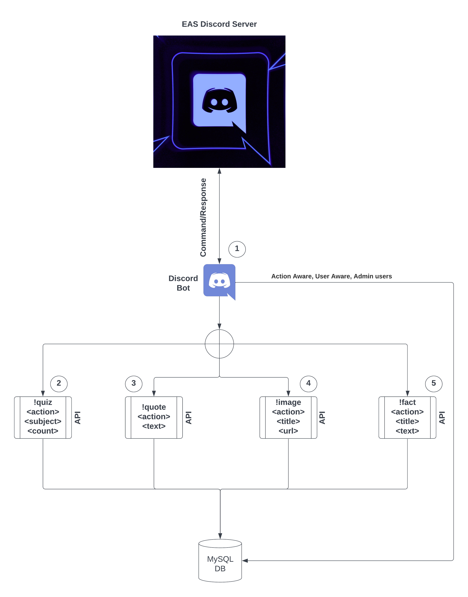

# discord-bot

Tasked with producing microservices, which utilise a database for storage, this repository holds a Discord bot to interface between the Discord server and game APIs.

## Usage

```Golang
    go run main.go
```

## Expected API response format

```
// Expected validation response on /api/validation/appname,command
{"status":"success","status_message":"valid_command"}

// Expected successful command response on /api/command/appname,command
{"status": "success", "status_message": "insert status message here", "discord_message": "message for discord here"}
```

## NOTES

## Features

- [ ] Concurrently handle connections

- [x]Handle syscall.ECONNREFUSED

- [ ] Roles included in request headers

- [ ] Callbacks

- [x] MySQL DB (Containerised?)

- [ ] User permissions

- [ ] standard syn/ack stuff

- [x] adding/listing/removing actions from the db with user group permissions

## Diagram


